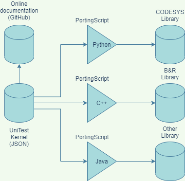

# UniTest (Universal PLC Unit Test Library)


UniTest is a PLC, IDE and manufacturer agnostic library written using only the features of the IEC61131 standard. Due to this, portability to all IEC compliant platforms is straightforward and can be achieved programmatically or with minimal manual work.

## Last release test results

| Kernel tests pass | Codesys tests pass | B&R tests pass |  
| ----------------- | ------------------ | -------------- |  
| 100.0 | 100.0 | 100.0 |  

## Main idea

The platform agnostic library, further known as the Kernel, is provided in the JSON format so it can be accessed programmatically by the programmers language of choice. The Kernel is a definition of all POUs and Data types that needs to be recreated in the target system. It holds the assert functions library and a collection of test PRGs. The Kernel is succesfully ported when all PRGs on the target system pass all tests.



### Why you should use it

There are many frameworks for unit testing in the world but in the Industrial automation world there are virtually none. Certain PLC orientated UnitTest frameworks do exists but they are often designed for specific IDEs. Those frameworks are then incompatible with other platforms. If your platform doesn't have any unit testing frameworks developed, here is where this library tries to help.

## Documentation

Each assert function has a software description accessible by browsing this repositories [docs folder](docs/index.md). The documentation link is also included in the Kernel and in the code itself.

## Usage of the unit test framework

The usage of the library can be checked from the included programs in the Library_tests namespace which can be imported into the target system.
The library end user can implement the assert functions into its own solutions. As the library and the test cases are written in structured text the test cases are easily programmatically created. For example, the test cases for all the library assert functions were written by a script.

### General example of POU under test case

```pascal
INTERFACE
    VAR 
        vTestCases : ARRAY[0..20] OF utTestCase; (*Definition of all test cases for this POU*)
        testRunner : utTestSuite; (*Test Suite fb instance to run the tests*)
        vTestCase1_act : INT; (*Data 1 of test case 1*)
        vTestCase1_xp : INT; (*Data 2 of test case 1*)
        vTestCase2_act : INT; (*Data 3 of test case 2*)
        vTestCase2_xp : INT; (*Data 4 of test case 2*)
    END_VAR
END_INTERFACE
PROGRAM _CYCLIC
    (*Run the test cases*)
    (*Here the tests have been divided into actions for easier programming and readability*)
    (*Test 1 components*)
    TEST_CASE_1_SETUP; (*Here we set up the variables, pou under test etc*)
    TEST_CASE_1_EXEC; (*Here we actually conduct the test*)

    TEST_CASE_2_SETUP;
    TEST_CASE_2_EXEC;

    (*Instantiate the test runner*)
    testRunner(
    	Id := 138, (*Id must be unique. This is also used to write the results to a unique index of the global results variable*)
    	Name := 'fcSumTwoNumbers', (*Name of the POU under test*)
        RunTests := gRunAll, (*Flag to start the tests*)
    	ResetTests := gResetAll, (*Flag to reset the tests*)
    	TestCases:=vTestCases); (*Local test case results array for summarizing*)

    (*Report the results to the collection global. The global can be used to keep track of all POUs under test and 
    their results.*)
    gResults[testRunner.Id] := testRunner.Summary;
END_PROGRAM
ACTION TEST_CASE_1_SETUP :
    IF vTestCases[0].state = ut_SETUP THEN
    	(*Setup the test case information*)
    	vTestCases[0].id := 1; (*Id is to identify this test from the rest of this POUs tests*)
        (*Description fields are available to describe what the test is all about and additional information*)
    	vTestCases[0].desc[0] := 'CHECK SUM 1 +1';
        vTestCases[0].desc[1] := 'Tests if the function returns the sum of 1+1 as 2';
    	vTestCases[0].desc[2] := 'PASS IF: 1+1 = 2';
    	
    	(*Setup needed variables*)
    	vTestCase1_act:= 0;
    	vTestCase1_xp := 2;

        (*The program is waiting in this action until the user starts the test. The test runner changes the vTestCases[0].state to utRunning*)
    END_IF
END_ACTION
ACTION TEST_CASE_1_EXEC :
    IF vTestCases[0].state = ut_RUNNING THEN
    	(*Run the test case*)
        vTestCase1_act = fcSumTwoNumbers(1, 1);

    	IF assertEqual_INT(vTestCase1_act, vTestCase1_xp) THEN
    		vTestCases[0].state := ut_PASSED;
    		vTestCases[0].msg := 'Expected == Returned -> PASS';
    	ELSE
    		vTestCases[0].state := ut_FAILED;
    		vTestCases[0].msg := 'Expected <> Returned -> FAIL';
    	END_IF
    END_IF
    (*The test case changes the state to ut_PASSED or ut_FAILED. This can be used if the test needs to be conducted
    in multiple cycles.
    When the user clicks the reset all button the test moves to the ut_SETUP state and can be started again*)
END_ACTION
ACTION TEST_CASE_2_SETUP :
    IF vTestCases[1].state = ut_SETUP THEN
    	(*Setup the test case information*)
    	vTestCases[1].id := 2;
    	vTestCases[1].desc[0] := 'CHECK SUM -1 + 9';
        vTestCases[1].desc[1] := 'Tests if the function returns the sum of -1+9 as 8';
    	vTestCases[1].desc[2] := 'PASS IF: -1+9 = 8';
    	
    	(*Setup needed variables*)
    	vTestCase2_act := 0;
    	vTestCase2_xp := 8;
    END_IF
END_ACTION
ACTION TEST_CASE_2_EXEC :
    IF vTestCases[1].state = ut_RUNNING THEN
    	(*Run the test case*)
        vTestCase2_act = fcSumTwoNumbers(-1, 9);

    	IF assertEqual_INT(vTestCase2_act, vTestCase2_xp) THEN
    		vTestCases[1].state := ut_PASSED;
    		vTestCases[1].msg := 'Expected == Returned -> PASS';
    	ELSE
    		vTestCases[1].state := ut_FAILED;
    		vTestCases[1].msg := 'Expected <> Returned -> FAIL';
    	END_IF
    END_IF
END_ACTION
```

## Assert functions available

|  C  |  C  |  C  |  C  |  C  |  
| --- | --- | --- | --- | --- |  
| [assertFalse](https://github.com/tkucic/iecUniTest/blob/main/docs/docs/ns/iecUniTest/fc/assertFalse.md) | [assertEqual_BOOL](https://github.com/tkucic/iecUniTest/blob/main/docs/docs/ns/iecUniTest/fc/assertEqual_BOOL.md) | [assertEqual_BYTE](https://github.com/tkucic/iecUniTest/blob/main/docs/docs/ns/iecUniTest/fc/assertEqual_BYTE.md) | [assertEqual_WORD](https://github.com/tkucic/iecUniTest/blob/main/docs/docs/ns/iecUniTest/fc/assertEqual_WORD.md) | [assertEqual_DWORD](https://github.com/tkucic/iecUniTest/blob/main/docs/docs/ns/iecUniTest/fc/assertEqual_DWORD.md) |  
| [assertEqual_LWORD](https://github.com/tkucic/iecUniTest/blob/main/docs/docs/ns/iecUniTest/fc/assertEqual_LWORD.md) | [assertEqual_SINT](https://github.com/tkucic/iecUniTest/blob/main/docs/docs/ns/iecUniTest/fc/assertEqual_SINT.md) | [assertEqual_USINT](https://github.com/tkucic/iecUniTest/blob/main/docs/docs/ns/iecUniTest/fc/assertEqual_USINT.md) | [assertEqual_INT](https://github.com/tkucic/iecUniTest/blob/main/docs/docs/ns/iecUniTest/fc/assertEqual_INT.md) | [assertEqual_UINT](https://github.com/tkucic/iecUniTest/blob/main/docs/docs/ns/iecUniTest/fc/assertEqual_UINT.md) |  
| [assertEqual_DINT](https://github.com/tkucic/iecUniTest/blob/main/docs/docs/ns/iecUniTest/fc/assertEqual_DINT.md) | [assertEqual_UDINT](https://github.com/tkucic/iecUniTest/blob/main/docs/docs/ns/iecUniTest/fc/assertEqual_UDINT.md) | [assertEqual_LINT](https://github.com/tkucic/iecUniTest/blob/main/docs/docs/ns/iecUniTest/fc/assertEqual_LINT.md) | [assertEqual_ULINT](https://github.com/tkucic/iecUniTest/blob/main/docs/docs/ns/iecUniTest/fc/assertEqual_ULINT.md) | [assertEqual_REAL](https://github.com/tkucic/iecUniTest/blob/main/docs/docs/ns/iecUniTest/fc/assertEqual_REAL.md) |  
| [assertEqual_LREAL](https://github.com/tkucic/iecUniTest/blob/main/docs/docs/ns/iecUniTest/fc/assertEqual_LREAL.md) | [assertEqual_STRING](https://github.com/tkucic/iecUniTest/blob/main/docs/docs/ns/iecUniTest/fc/assertEqual_STRING.md) | [assertEqual_WSTRING](https://github.com/tkucic/iecUniTest/blob/main/docs/docs/ns/iecUniTest/fc/assertEqual_WSTRING.md) | [assertEqual_TIME](https://github.com/tkucic/iecUniTest/blob/main/docs/docs/ns/iecUniTest/fc/assertEqual_TIME.md) | [assertEqual_LTIME](https://github.com/tkucic/iecUniTest/blob/main/docs/docs/ns/iecUniTest/fc/assertEqual_LTIME.md) |  
| [assertEqual_DATE](https://github.com/tkucic/iecUniTest/blob/main/docs/docs/ns/iecUniTest/fc/assertEqual_DATE.md) | [assertEqual_LDATE](https://github.com/tkucic/iecUniTest/blob/main/docs/docs/ns/iecUniTest/fc/assertEqual_LDATE.md) | [assertEqual_DATE_AND_TIME](https://github.com/tkucic/iecUniTest/blob/main/docs/docs/ns/iecUniTest/fc/assertEqual_DATE_AND_TIME.md) | [assertEqual_LDATE_AND_TIME](https://github.com/tkucic/iecUniTest/blob/main/docs/docs/ns/iecUniTest/fc/assertEqual_LDATE_AND_TIME.md) | [assertEqual_TIME_OF_DAY](https://github.com/tkucic/iecUniTest/blob/main/docs/docs/ns/iecUniTest/fc/assertEqual_TIME_OF_DAY.md) |  
| [assertEqual_LTIME_OF_DAY](https://github.com/tkucic/iecUniTest/blob/main/docs/docs/ns/iecUniTest/fc/assertEqual_LTIME_OF_DAY.md) | [assertNotEqual_BOOL](https://github.com/tkucic/iecUniTest/blob/main/docs/docs/ns/iecUniTest/fc/assertNotEqual_BOOL.md) | [assertNotEqual_BYTE](https://github.com/tkucic/iecUniTest/blob/main/docs/docs/ns/iecUniTest/fc/assertNotEqual_BYTE.md) | [assertNotEqual_WORD](https://github.com/tkucic/iecUniTest/blob/main/docs/docs/ns/iecUniTest/fc/assertNotEqual_WORD.md) | [assertNotEqual_DWORD](https://github.com/tkucic/iecUniTest/blob/main/docs/docs/ns/iecUniTest/fc/assertNotEqual_DWORD.md) |  
| [assertNotEqual_LWORD](https://github.com/tkucic/iecUniTest/blob/main/docs/docs/ns/iecUniTest/fc/assertNotEqual_LWORD.md) | [assertNotEqual_SINT](https://github.com/tkucic/iecUniTest/blob/main/docs/docs/ns/iecUniTest/fc/assertNotEqual_SINT.md) | [assertNotEqual_USINT](https://github.com/tkucic/iecUniTest/blob/main/docs/docs/ns/iecUniTest/fc/assertNotEqual_USINT.md) | [assertNotEqual_INT](https://github.com/tkucic/iecUniTest/blob/main/docs/docs/ns/iecUniTest/fc/assertNotEqual_INT.md) | [assertNotEqual_UINT](https://github.com/tkucic/iecUniTest/blob/main/docs/docs/ns/iecUniTest/fc/assertNotEqual_UINT.md) |  
| [assertNotEqual_DINT](https://github.com/tkucic/iecUniTest/blob/main/docs/docs/ns/iecUniTest/fc/assertNotEqual_DINT.md) | [assertNotEqual_UDINT](https://github.com/tkucic/iecUniTest/blob/main/docs/docs/ns/iecUniTest/fc/assertNotEqual_UDINT.md) | [assertNotEqual_LINT](https://github.com/tkucic/iecUniTest/blob/main/docs/docs/ns/iecUniTest/fc/assertNotEqual_LINT.md) | [assertNotEqual_ULINT](https://github.com/tkucic/iecUniTest/blob/main/docs/docs/ns/iecUniTest/fc/assertNotEqual_ULINT.md) | [assertNotEqual_REAL](https://github.com/tkucic/iecUniTest/blob/main/docs/docs/ns/iecUniTest/fc/assertNotEqual_REAL.md) |  
| [assertNotEqual_LREAL](https://github.com/tkucic/iecUniTest/blob/main/docs/docs/ns/iecUniTest/fc/assertNotEqual_LREAL.md) | [assertNotEqual_STRING](https://github.com/tkucic/iecUniTest/blob/main/docs/docs/ns/iecUniTest/fc/assertNotEqual_STRING.md) | [assertNotEqual_WSTRING](https://github.com/tkucic/iecUniTest/blob/main/docs/docs/ns/iecUniTest/fc/assertNotEqual_WSTRING.md) | [assertNotEqual_TIME](https://github.com/tkucic/iecUniTest/blob/main/docs/docs/ns/iecUniTest/fc/assertNotEqual_TIME.md) | [assertNotEqual_LTIME](https://github.com/tkucic/iecUniTest/blob/main/docs/docs/ns/iecUniTest/fc/assertNotEqual_LTIME.md) |  
| [assertNotEqual_DATE](https://github.com/tkucic/iecUniTest/blob/main/docs/docs/ns/iecUniTest/fc/assertNotEqual_DATE.md) | [assertNotEqual_LDATE](https://github.com/tkucic/iecUniTest/blob/main/docs/docs/ns/iecUniTest/fc/assertNotEqual_LDATE.md) | [assertNotEqual_DATE_AND_TIME](https://github.com/tkucic/iecUniTest/blob/main/docs/docs/ns/iecUniTest/fc/assertNotEqual_DATE_AND_TIME.md) | [assertNotEqual_LDATE_AND_TIME](https://github.com/tkucic/iecUniTest/blob/main/docs/docs/ns/iecUniTest/fc/assertNotEqual_LDATE_AND_TIME.md) | [assertNotEqual_TIME_OF_DAY](https://github.com/tkucic/iecUniTest/blob/main/docs/docs/ns/iecUniTest/fc/assertNotEqual_TIME_OF_DAY.md) |  
| [assertNotEqual_LTIME_OF_DAY](https://github.com/tkucic/iecUniTest/blob/main/docs/docs/ns/iecUniTest/fc/assertNotEqual_LTIME_OF_DAY.md) | [assertGreater_BYTE](https://github.com/tkucic/iecUniTest/blob/main/docs/docs/ns/iecUniTest/fc/assertGreater_BYTE.md) | [assertGreater_WORD](https://github.com/tkucic/iecUniTest/blob/main/docs/docs/ns/iecUniTest/fc/assertGreater_WORD.md) | [assertGreater_DWORD](https://github.com/tkucic/iecUniTest/blob/main/docs/docs/ns/iecUniTest/fc/assertGreater_DWORD.md) | [assertGreater_LWORD](https://github.com/tkucic/iecUniTest/blob/main/docs/docs/ns/iecUniTest/fc/assertGreater_LWORD.md) |  
| [assertGreater_SINT](https://github.com/tkucic/iecUniTest/blob/main/docs/docs/ns/iecUniTest/fc/assertGreater_SINT.md) | [assertGreater_USINT](https://github.com/tkucic/iecUniTest/blob/main/docs/docs/ns/iecUniTest/fc/assertGreater_USINT.md) | [assertGreater_INT](https://github.com/tkucic/iecUniTest/blob/main/docs/docs/ns/iecUniTest/fc/assertGreater_INT.md) | [assertGreater_UINT](https://github.com/tkucic/iecUniTest/blob/main/docs/docs/ns/iecUniTest/fc/assertGreater_UINT.md) | [assertGreater_DINT](https://github.com/tkucic/iecUniTest/blob/main/docs/docs/ns/iecUniTest/fc/assertGreater_DINT.md) |  
| [assertGreater_UDINT](https://github.com/tkucic/iecUniTest/blob/main/docs/docs/ns/iecUniTest/fc/assertGreater_UDINT.md) | [assertGreater_LINT](https://github.com/tkucic/iecUniTest/blob/main/docs/docs/ns/iecUniTest/fc/assertGreater_LINT.md) | [assertGreater_ULINT](https://github.com/tkucic/iecUniTest/blob/main/docs/docs/ns/iecUniTest/fc/assertGreater_ULINT.md) | [assertGreater_REAL](https://github.com/tkucic/iecUniTest/blob/main/docs/docs/ns/iecUniTest/fc/assertGreater_REAL.md) | [assertGreater_LREAL](https://github.com/tkucic/iecUniTest/blob/main/docs/docs/ns/iecUniTest/fc/assertGreater_LREAL.md) |  
| [assertGreater_TIME](https://github.com/tkucic/iecUniTest/blob/main/docs/docs/ns/iecUniTest/fc/assertGreater_TIME.md) | [assertGreater_LTIME](https://github.com/tkucic/iecUniTest/blob/main/docs/docs/ns/iecUniTest/fc/assertGreater_LTIME.md) | [assertGreater_DATE](https://github.com/tkucic/iecUniTest/blob/main/docs/docs/ns/iecUniTest/fc/assertGreater_DATE.md) | [assertGreater_LDATE](https://github.com/tkucic/iecUniTest/blob/main/docs/docs/ns/iecUniTest/fc/assertGreater_LDATE.md) | [assertGreater_DATE_AND_TIME](https://github.com/tkucic/iecUniTest/blob/main/docs/docs/ns/iecUniTest/fc/assertGreater_DATE_AND_TIME.md) |  
| [assertGreater_LDATE_AND_TIME](https://github.com/tkucic/iecUniTest/blob/main/docs/docs/ns/iecUniTest/fc/assertGreater_LDATE_AND_TIME.md) | [assertGreater_TIME_OF_DAY](https://github.com/tkucic/iecUniTest/blob/main/docs/docs/ns/iecUniTest/fc/assertGreater_TIME_OF_DAY.md) | [assertGreater_LTIME_OF_DAY](https://github.com/tkucic/iecUniTest/blob/main/docs/docs/ns/iecUniTest/fc/assertGreater_LTIME_OF_DAY.md) | [assertGreaterEqual_BYTE](https://github.com/tkucic/iecUniTest/blob/main/docs/docs/ns/iecUniTest/fc/assertGreaterEqual_BYTE.md) | [assertGreaterEqual_WORD](https://github.com/tkucic/iecUniTest/blob/main/docs/docs/ns/iecUniTest/fc/assertGreaterEqual_WORD.md) |  
| [assertGreaterEqual_DWORD](https://github.com/tkucic/iecUniTest/blob/main/docs/docs/ns/iecUniTest/fc/assertGreaterEqual_DWORD.md) | [assertGreaterEqual_LWORD](https://github.com/tkucic/iecUniTest/blob/main/docs/docs/ns/iecUniTest/fc/assertGreaterEqual_LWORD.md) | [assertGreaterEqual_SINT](https://github.com/tkucic/iecUniTest/blob/main/docs/docs/ns/iecUniTest/fc/assertGreaterEqual_SINT.md) | [assertGreaterEqual_USINT](https://github.com/tkucic/iecUniTest/blob/main/docs/docs/ns/iecUniTest/fc/assertGreaterEqual_USINT.md) | [assertGreaterEqual_INT](https://github.com/tkucic/iecUniTest/blob/main/docs/docs/ns/iecUniTest/fc/assertGreaterEqual_INT.md) |  
| [assertGreaterEqual_UINT](https://github.com/tkucic/iecUniTest/blob/main/docs/docs/ns/iecUniTest/fc/assertGreaterEqual_UINT.md) | [assertGreaterEqual_DINT](https://github.com/tkucic/iecUniTest/blob/main/docs/docs/ns/iecUniTest/fc/assertGreaterEqual_DINT.md) | [assertGreaterEqual_UDINT](https://github.com/tkucic/iecUniTest/blob/main/docs/docs/ns/iecUniTest/fc/assertGreaterEqual_UDINT.md) | [assertGreaterEqual_LINT](https://github.com/tkucic/iecUniTest/blob/main/docs/docs/ns/iecUniTest/fc/assertGreaterEqual_LINT.md) | [assertGreaterEqual_ULINT](https://github.com/tkucic/iecUniTest/blob/main/docs/docs/ns/iecUniTest/fc/assertGreaterEqual_ULINT.md) |  
| [assertGreaterEqual_REAL](https://github.com/tkucic/iecUniTest/blob/main/docs/docs/ns/iecUniTest/fc/assertGreaterEqual_REAL.md) | [assertGreaterEqual_LREAL](https://github.com/tkucic/iecUniTest/blob/main/docs/docs/ns/iecUniTest/fc/assertGreaterEqual_LREAL.md) | [assertGreaterEqual_TIME](https://github.com/tkucic/iecUniTest/blob/main/docs/docs/ns/iecUniTest/fc/assertGreaterEqual_TIME.md) | [assertGreaterEqual_LTIME](https://github.com/tkucic/iecUniTest/blob/main/docs/docs/ns/iecUniTest/fc/assertGreaterEqual_LTIME.md) | [assertGreaterEqual_DATE](https://github.com/tkucic/iecUniTest/blob/main/docs/docs/ns/iecUniTest/fc/assertGreaterEqual_DATE.md) |  
| [assertGreaterEqual_LDATE](https://github.com/tkucic/iecUniTest/blob/main/docs/docs/ns/iecUniTest/fc/assertGreaterEqual_LDATE.md) | [assertGreaterEqual_DATE_AND_TIME](https://github.com/tkucic/iecUniTest/blob/main/docs/docs/ns/iecUniTest/fc/assertGreaterEqual_DATE_AND_TIME.md) | [assertGreaterEqual_LDATE_AND_TIME](https://github.com/tkucic/iecUniTest/blob/main/docs/docs/ns/iecUniTest/fc/assertGreaterEqual_LDATE_AND_TIME.md) | [assertGreaterEqual_TIME_OF_DAY](https://github.com/tkucic/iecUniTest/blob/main/docs/docs/ns/iecUniTest/fc/assertGreaterEqual_TIME_OF_DAY.md) | [assertGreaterEqual_LTIME_OF_DAY](https://github.com/tkucic/iecUniTest/blob/main/docs/docs/ns/iecUniTest/fc/assertGreaterEqual_LTIME_OF_DAY.md) |  
| [assertLess_BYTE](https://github.com/tkucic/iecUniTest/blob/main/docs/docs/ns/iecUniTest/fc/assertLess_BYTE.md) | [assertLess_WORD](https://github.com/tkucic/iecUniTest/blob/main/docs/docs/ns/iecUniTest/fc/assertLess_WORD.md) | [assertLess_DWORD](https://github.com/tkucic/iecUniTest/blob/main/docs/docs/ns/iecUniTest/fc/assertLess_DWORD.md) | [assertLess_LWORD](https://github.com/tkucic/iecUniTest/blob/main/docs/docs/ns/iecUniTest/fc/assertLess_LWORD.md) | [assertLess_SINT](https://github.com/tkucic/iecUniTest/blob/main/docs/docs/ns/iecUniTest/fc/assertLess_SINT.md) |  
| [assertLess_USINT](https://github.com/tkucic/iecUniTest/blob/main/docs/docs/ns/iecUniTest/fc/assertLess_USINT.md) | [assertLess_INT](https://github.com/tkucic/iecUniTest/blob/main/docs/docs/ns/iecUniTest/fc/assertLess_INT.md) | [assertLess_UINT](https://github.com/tkucic/iecUniTest/blob/main/docs/docs/ns/iecUniTest/fc/assertLess_UINT.md) | [assertLess_DINT](https://github.com/tkucic/iecUniTest/blob/main/docs/docs/ns/iecUniTest/fc/assertLess_DINT.md) | [assertLess_UDINT](https://github.com/tkucic/iecUniTest/blob/main/docs/docs/ns/iecUniTest/fc/assertLess_UDINT.md) |  
| [assertLess_LINT](https://github.com/tkucic/iecUniTest/blob/main/docs/docs/ns/iecUniTest/fc/assertLess_LINT.md) | [assertLess_ULINT](https://github.com/tkucic/iecUniTest/blob/main/docs/docs/ns/iecUniTest/fc/assertLess_ULINT.md) | [assertLess_REAL](https://github.com/tkucic/iecUniTest/blob/main/docs/docs/ns/iecUniTest/fc/assertLess_REAL.md) | [assertLess_LREAL](https://github.com/tkucic/iecUniTest/blob/main/docs/docs/ns/iecUniTest/fc/assertLess_LREAL.md) | [assertLess_TIME](https://github.com/tkucic/iecUniTest/blob/main/docs/docs/ns/iecUniTest/fc/assertLess_TIME.md) |  
| [assertLess_LTIME](https://github.com/tkucic/iecUniTest/blob/main/docs/docs/ns/iecUniTest/fc/assertLess_LTIME.md) | [assertLess_DATE](https://github.com/tkucic/iecUniTest/blob/main/docs/docs/ns/iecUniTest/fc/assertLess_DATE.md) | [assertLess_LDATE](https://github.com/tkucic/iecUniTest/blob/main/docs/docs/ns/iecUniTest/fc/assertLess_LDATE.md) | [assertLess_DATE_AND_TIME](https://github.com/tkucic/iecUniTest/blob/main/docs/docs/ns/iecUniTest/fc/assertLess_DATE_AND_TIME.md) | [assertLess_LDATE_AND_TIME](https://github.com/tkucic/iecUniTest/blob/main/docs/docs/ns/iecUniTest/fc/assertLess_LDATE_AND_TIME.md) |  
| [assertLess_TIME_OF_DAY](https://github.com/tkucic/iecUniTest/blob/main/docs/docs/ns/iecUniTest/fc/assertLess_TIME_OF_DAY.md) | [assertLess_LTIME_OF_DAY](https://github.com/tkucic/iecUniTest/blob/main/docs/docs/ns/iecUniTest/fc/assertLess_LTIME_OF_DAY.md) | [assertLessEqual_BYTE](https://github.com/tkucic/iecUniTest/blob/main/docs/docs/ns/iecUniTest/fc/assertLessEqual_BYTE.md) | [assertLessEqual_WORD](https://github.com/tkucic/iecUniTest/blob/main/docs/docs/ns/iecUniTest/fc/assertLessEqual_WORD.md) | [assertLessEqual_DWORD](https://github.com/tkucic/iecUniTest/blob/main/docs/docs/ns/iecUniTest/fc/assertLessEqual_DWORD.md) |  
| [assertLessEqual_LWORD](https://github.com/tkucic/iecUniTest/blob/main/docs/docs/ns/iecUniTest/fc/assertLessEqual_LWORD.md) | [assertLessEqual_SINT](https://github.com/tkucic/iecUniTest/blob/main/docs/docs/ns/iecUniTest/fc/assertLessEqual_SINT.md) | [assertLessEqual_USINT](https://github.com/tkucic/iecUniTest/blob/main/docs/docs/ns/iecUniTest/fc/assertLessEqual_USINT.md) | [assertLessEqual_INT](https://github.com/tkucic/iecUniTest/blob/main/docs/docs/ns/iecUniTest/fc/assertLessEqual_INT.md) | [assertLessEqual_UINT](https://github.com/tkucic/iecUniTest/blob/main/docs/docs/ns/iecUniTest/fc/assertLessEqual_UINT.md) |  
| [assertLessEqual_DINT](https://github.com/tkucic/iecUniTest/blob/main/docs/docs/ns/iecUniTest/fc/assertLessEqual_DINT.md) | [assertLessEqual_UDINT](https://github.com/tkucic/iecUniTest/blob/main/docs/docs/ns/iecUniTest/fc/assertLessEqual_UDINT.md) | [assertLessEqual_LINT](https://github.com/tkucic/iecUniTest/blob/main/docs/docs/ns/iecUniTest/fc/assertLessEqual_LINT.md) | [assertLessEqual_ULINT](https://github.com/tkucic/iecUniTest/blob/main/docs/docs/ns/iecUniTest/fc/assertLessEqual_ULINT.md) | [assertLessEqual_REAL](https://github.com/tkucic/iecUniTest/blob/main/docs/docs/ns/iecUniTest/fc/assertLessEqual_REAL.md) |  
| [assertLessEqual_LREAL](https://github.com/tkucic/iecUniTest/blob/main/docs/docs/ns/iecUniTest/fc/assertLessEqual_LREAL.md) | [assertLessEqual_TIME](https://github.com/tkucic/iecUniTest/blob/main/docs/docs/ns/iecUniTest/fc/assertLessEqual_TIME.md) | [assertLessEqual_LTIME](https://github.com/tkucic/iecUniTest/blob/main/docs/docs/ns/iecUniTest/fc/assertLessEqual_LTIME.md) | [assertLessEqual_DATE](https://github.com/tkucic/iecUniTest/blob/main/docs/docs/ns/iecUniTest/fc/assertLessEqual_DATE.md) | [assertLessEqual_LDATE](https://github.com/tkucic/iecUniTest/blob/main/docs/docs/ns/iecUniTest/fc/assertLessEqual_LDATE.md) |  
| [assertLessEqual_DATE_AND_TIME](https://github.com/tkucic/iecUniTest/blob/main/docs/docs/ns/iecUniTest/fc/assertLessEqual_DATE_AND_TIME.md) | [assertLessEqual_LDATE_AND_TIME](https://github.com/tkucic/iecUniTest/blob/main/docs/docs/ns/iecUniTest/fc/assertLessEqual_LDATE_AND_TIME.md) | [assertLessEqual_TIME_OF_DAY](https://github.com/tkucic/iecUniTest/blob/main/docs/docs/ns/iecUniTest/fc/assertLessEqual_TIME_OF_DAY.md) | [assertLessEqual_LTIME_OF_DAY](https://github.com/tkucic/iecUniTest/blob/main/docs/docs/ns/iecUniTest/fc/assertLessEqual_LTIME_OF_DAY.md) | [assertArrayEqual_BOOL](https://github.com/tkucic/iecUniTest/blob/main/docs/docs/ns/iecUniTest/fc/assertArrayEqual_BOOL.md) |  
| [assertArrayEqual_BYTE](https://github.com/tkucic/iecUniTest/blob/main/docs/docs/ns/iecUniTest/fc/assertArrayEqual_BYTE.md) | [assertArrayEqual_WORD](https://github.com/tkucic/iecUniTest/blob/main/docs/docs/ns/iecUniTest/fc/assertArrayEqual_WORD.md) | [assertArrayEqual_DWORD](https://github.com/tkucic/iecUniTest/blob/main/docs/docs/ns/iecUniTest/fc/assertArrayEqual_DWORD.md) | [assertArrayEqual_LWORD](https://github.com/tkucic/iecUniTest/blob/main/docs/docs/ns/iecUniTest/fc/assertArrayEqual_LWORD.md) | [assertArrayEqual_SINT](https://github.com/tkucic/iecUniTest/blob/main/docs/docs/ns/iecUniTest/fc/assertArrayEqual_SINT.md) |  
| [assertArrayEqual_USINT](https://github.com/tkucic/iecUniTest/blob/main/docs/docs/ns/iecUniTest/fc/assertArrayEqual_USINT.md) | [assertArrayEqual_INT](https://github.com/tkucic/iecUniTest/blob/main/docs/docs/ns/iecUniTest/fc/assertArrayEqual_INT.md) | [assertArrayEqual_UINT](https://github.com/tkucic/iecUniTest/blob/main/docs/docs/ns/iecUniTest/fc/assertArrayEqual_UINT.md) | [assertArrayEqual_DINT](https://github.com/tkucic/iecUniTest/blob/main/docs/docs/ns/iecUniTest/fc/assertArrayEqual_DINT.md) | [assertArrayEqual_UDINT](https://github.com/tkucic/iecUniTest/blob/main/docs/docs/ns/iecUniTest/fc/assertArrayEqual_UDINT.md) |  
| [assertArrayEqual_LINT](https://github.com/tkucic/iecUniTest/blob/main/docs/docs/ns/iecUniTest/fc/assertArrayEqual_LINT.md) | [assertArrayEqual_ULINT](https://github.com/tkucic/iecUniTest/blob/main/docs/docs/ns/iecUniTest/fc/assertArrayEqual_ULINT.md) | [assertArrayEqual_REAL](https://github.com/tkucic/iecUniTest/blob/main/docs/docs/ns/iecUniTest/fc/assertArrayEqual_REAL.md) | [assertArrayEqual_LREAL](https://github.com/tkucic/iecUniTest/blob/main/docs/docs/ns/iecUniTest/fc/assertArrayEqual_LREAL.md) | [assertArrayEqual_STRING](https://github.com/tkucic/iecUniTest/blob/main/docs/docs/ns/iecUniTest/fc/assertArrayEqual_STRING.md) |  
| [assertArrayEqual_WSTRING](https://github.com/tkucic/iecUniTest/blob/main/docs/docs/ns/iecUniTest/fc/assertArrayEqual_WSTRING.md) | [assertArrayEqual_TIME](https://github.com/tkucic/iecUniTest/blob/main/docs/docs/ns/iecUniTest/fc/assertArrayEqual_TIME.md) | [assertArrayEqual_LTIME](https://github.com/tkucic/iecUniTest/blob/main/docs/docs/ns/iecUniTest/fc/assertArrayEqual_LTIME.md) | [assertArrayEqual_DATE](https://github.com/tkucic/iecUniTest/blob/main/docs/docs/ns/iecUniTest/fc/assertArrayEqual_DATE.md) | [assertArrayEqual_LDATE](https://github.com/tkucic/iecUniTest/blob/main/docs/docs/ns/iecUniTest/fc/assertArrayEqual_LDATE.md) |  
| [assertArrayEqual_DATE_AND_TIME](https://github.com/tkucic/iecUniTest/blob/main/docs/docs/ns/iecUniTest/fc/assertArrayEqual_DATE_AND_TIME.md) | [assertArrayEqual_LDATE_AND_TIME](https://github.com/tkucic/iecUniTest/blob/main/docs/docs/ns/iecUniTest/fc/assertArrayEqual_LDATE_AND_TIME.md) | [assertArrayEqual_TIME_OF_DAY](https://github.com/tkucic/iecUniTest/blob/main/docs/docs/ns/iecUniTest/fc/assertArrayEqual_TIME_OF_DAY.md) | [assertArrayEqual_LTIME_OF_DAY](https://github.com/tkucic/iecUniTest/blob/main/docs/docs/ns/iecUniTest/fc/assertArrayEqual_LTIME_OF_DAY.md) | [assertTrue](https://github.com/tkucic/iecUniTest/blob/main/docs/docs/ns/iecUniTest/fc/assertTrue.md) |  
| [utTestSuite](https://github.com/tkucic/iecUniTest/blob/main/docs/docs/ns/iecUniTest/fb/utTestSuite.md) | [utTestReporter](https://github.com/tkucic/iecUniTest/blob/main/docs/docs/ns/iecUniTest/fb/utTestReporter.md) | | | |  

## Contributing

We appreciate feedback and contribution to this repo! Before you get started, please see the following:

- [contribution guidelines](CONTRIBUTING.md)
- [code of conduct guidelines](CODE-OF-CONDUCT.md)
- [This repo's contribution guide](CONTRIBUTING.md)

## Support + Feedback

Include information on how to get support. Consider adding:

- Use [Issues](issues) for code-level support
- Use [Community]() for usage, questions, specific cases

## License

Published under the [MIT](LICENSE) license
